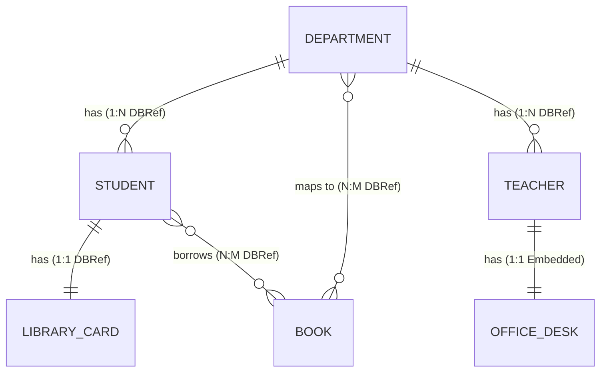

# CampusConnect 🎓

[](https://openjdk.org/)
[](https://spring.io/projects/spring-boot)
[](https://www.mongodb.com/)
[](https://gradle.org/)

CampusConnect is a premium, high-performance Spring Boot backend application demonstrating core CRUD operations and MongoDB document relationships (One-to-One, One-to-Many, Many-to-Many). The system utilizes both **Reference (`@DBRef`)** and **Embedded** document architectures, complete with an interactive terminal console daemon and Postman collections for verification.

---

## 🏗️ Architecture & Database Schema

The database consists of 5 independent collections and one nested sub-document structure, optimized for query performance and storage efficiency:



### Relationship Implementation Strategies

| Relationship | Entities | Strategy | Annotation / Mapping | Description |
| :--- | :--- | :--- | :--- | :--- |
| **One-to-One** | Student ↔ LibraryCard | Reference | `@DBRef` in `Student` | Decoupled entities, library card managed independently. |
| **One-to-One** | Teacher ↔ OfficeDesk | Embedded | Nested Class in `Teacher` | Tightly bound, office details saved nested inside teacher doc. |
| **One-to-Many** | Department ➔ Students | Reference | `@DBRef` in `Student` | Scale-safe reference from child back to department. |
| **One-to-Many** | Department ➔ Staff (Teachers) | Reference | `@DBRef` in `Teacher` | Reference from teacher document back to department. |
| **Many-to-Many** | Students ↔ Books | Reference | `@DBRef List<Book>` in `Student` | Library borrowing collection mapping. |
| **Many-to-Many** | Books ↔ Departments | Reference | `@DBRef List<Department>` in `Book` | Maps curricular books to multiple teaching departments. |

---

## 🛠️ Installation & Setup

### Prerequisites
1. **Java Development Kit (JDK)**: Java 21 or higher installed on your machine.
2. **MongoDB**: A local MongoDB database instance running on port `27017` (configured without auth for development).
3. **MongoDB Compass** (Optional): Useful for viewing collection schemas.

### 🚀 Running the Application
In your terminal, navigate to the project directory and run the Gradle wrapper command:

```bash
# Clean and compile the application
./gradlew compileJava

# Run the application
./gradlew bootRun
```
*Port `8080` must be free. Gradle automatically redirects keyboard inputs to the running Spring Boot application.*

---

## 🖥️ Terminal Interactive Console

CampusConnect comes built-in with an interactive menu. After running `./gradlew bootRun`, wait 3 seconds for the daemon prompt to initiate:

```text
==================================================
            CAMPUSCONNECT TERMINAL MENU           
==================================================
1. View Counts of All Collections
2. Create a Department
3. Create a Student
4. Create a Teacher (with Office Desk)
5. Create & Link Library Card to a Student
6. List all Students in a Department
7. Run Relationship Demo (1-1, 1:N, N:M)
8. Exit Menu
==================================================
Enter your choice (1-8):
```

### 🧪 Automated Relationship Demo (Option 7)
Enter `7` in the menu to trigger an automated relationship test run. It will:
1. Clear all existing data in the database.
2. Create a `Department` ("Computer Science").
3. Create a `Teacher` with an **embedded** `OfficeDesk` sub-document.
4. Create a `LibraryCard` and a `Student` linked via **DBRef**.
5. Map the student and teacher to the department.
6. Create library books and borrow them under the student record.
7. Print the **raw database JSON output** of each model so you can see exactly how references (`$ref`, `$id`) and embedded documents look inside MongoDB.

---

## 📡 REST API Documentation

All API requests and responses utilize JSON formats. The base URL is `http://localhost:8080`.

### 1. Departments (`/api/departments`)
* `POST /api/departments` - Create a department.
* `POST /api/departments/bulk` - Bulk insert departments.
* `GET /api/departments` - Get all departments.
* `GET /api/departments/{id}` - Fetch a department by ID.
* `PUT /api/departments/{id}` - Full update department.
* `PATCH /api/departments/{id}` - Partial update department.
* `DELETE /api/departments/{id}` - Delete department.
* `DELETE /api/departments` - Clear departments collection.

**Sample Request Body (POST /api/departments)**:
```json
{
  "name": "Computer Science and Engineering",
  "code": "CSE"
}
```

---

### 2. Students (`/api/students`)
* `POST /api/students` - Create student.
* `POST /api/students/bulk` - Bulk insert students.
* `GET /api/students` - Get all students.
* `GET /api/students/{id}` - Get student by ID.
* `GET /api/students/department/{deptId}` - Fetch all students inside a specific department.
* `PUT /api/students/{id}` - Full student update.
* `PATCH /api/students/{id}` - Partial student update.
* `POST /api/students/{id}/borrow/{bookId}` - Borrow a book (creates relationship link).
* `POST /api/students/{id}/return/{bookId}` - Return a book (removes relationship link).
* `DELETE /api/students/{id}` - Delete student.
* `DELETE /api/students` - Clear student collection.

**Sample Request Body (POST /api/students)**:
```json
{
  "name": "John Doe",
  "email": "johndoe@campus.edu",
  "department": {
    "id": "65b4fc297bcf6d3b4a2f8c5c"
  },
  "libraryCard": {
    "id": "65b4fc297bcf6d3b4a2f8c5d"
  }
}
```

---

### 3. Teachers / Staff (`/api/teachers`)
* `POST /api/teachers` - Create teacher (includes embedded desk).
* `POST /api/teachers/bulk` - Bulk insert teachers.
* `GET /api/teachers` - Get all teachers.
* `GET /api/teachers/{id}` - Get teacher by ID.
* `GET /api/teachers/department/{deptId}` - Fetch all teachers inside a specific department.
* `PUT /api/teachers/{id}` - Full update teacher.
* `PATCH /api/teachers/{id}` - Partial update teacher.
* `DELETE /api/teachers/{id}` - Delete teacher.
* `DELETE /api/teachers` - Clear teacher collection.

**Sample Request Body (POST /api/teachers)**:
```json
{
  "name": "Dr. Sarah Connor",
  "email": "sconnor@campus.edu",
  "specialization": "Artificial Intelligence",
  "department": {
    "id": "65b4fc297bcf6d3b4a2f8c5c"
  },
  "officeDesk": {
    "deskNumber": "D-402",
    "building": "Turing Labs",
    "floor": 4
  }
}
```

---

### 4. Books (`/api/books`)
* `POST /api/books` - Create a book.
* `POST /api/books/bulk` - Bulk insert books.
* `GET /api/books` - Fetch all books.
* `GET /api/books/{id}` - Fetch a book by ID.
* `GET /api/books/department/{deptId}` - Get all books mapping to a department.
* `PUT /api/books/{id}` - Full update book.
* `PATCH /api/books/{id}` - Partial update book.
* `DELETE /api/books/{id}` - Delete book.
* `DELETE /api/books` - Clear book collection.

**Sample Request Body (POST /api/books)**:
```json
{
  "title": "Clean Code",
  "author": "Robert C. Martin",
  "isbn": "978-0132350884",
  "departments": [
    {
      "id": "65b4fc297bcf6d3b4a2f8c5c"
    }
  ]
}
```

---

### 5. Library Cards (`/api/library-cards`)
* `POST /api/library-cards` - Create library card.
* `POST /api/library-cards/bulk` - Bulk insert cards.
* `GET /api/library-cards` - Fetch all cards.
* `GET /api/library-cards/{id}` - Fetch card by ID.
* `PUT /api/library-cards/{id}` - Full update card.
* `PATCH /api/library-cards/{id}` - Partial update card.
* `DELETE /api/library-cards/{id}` - Delete card.
* `DELETE /api/library-cards` - Clear cards collection.

---

## 🧪 Postman API Verification
To test the API endpoints:
1. Import the Postman collection file `CampusConnect.postman_collection.json` into Postman.
2. In the collection variables configuration, replace the target IDs (e.g. `deptId`, `studentId`, `cardId`) with the strings returned from your POST requests.
3. Execute standard runner requests.

---

## 📝 Logging & Audits
Every CRUD operation writes detailed logs to standard output:
```text
2026-06-18 09:12:45.321  INFO 25410 --- [nio-8080-exec-3] c.c.c.service.StudentService            : Student ID: 65b4fc29... borrowing book ID: 65b4fc32...
2026-06-18 09:12:45.335  INFO 25410 --- [nio-8080-exec-3] c.c.c.service.StudentService            : Book ID: 65b4fc32... successfully borrowed by student ID: 65b4fc29...
```
This logs precise timestamps, HTTP thread execution IDs, service class origins, and operation details.
